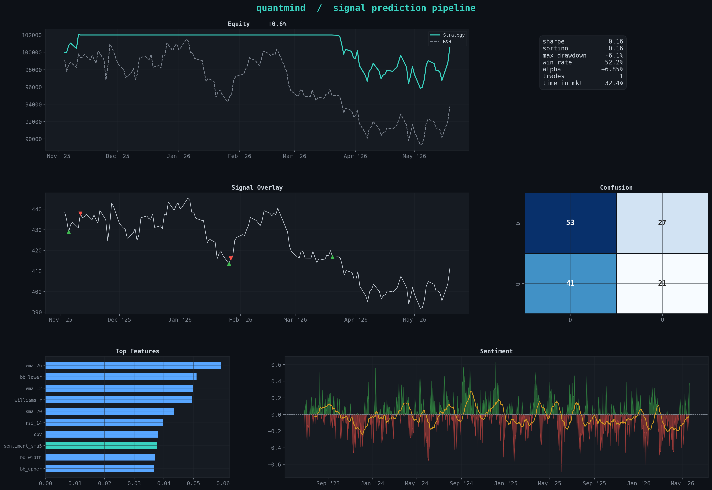

# quantmind

Trading signal prediction pipeline that combines technical indicators,
LLM-based sentiment analysis, and gradient-boosted classifiers to forecast
short-term equity price direction.



## Overview

The pipeline fetches daily OHLCV data, engineers 25+ technical features,
generates a sentiment time-series (optionally scored by Claude via the
Anthropic API), trains an XGBoost binary classifier with walk-forward
cross-validation, and backtests a long/flat strategy on the held-out window.

```
OHLCV data ─── technical features ──┐
                                     ├── XGBoost ── backtest ── charts
headlines ─── LLM sentiment ────────┘
```

### Key design decisions

- **No lookahead leakage.** Train/test split is purely temporal; walk-forward
  CV mirrors how the model would be retrained in production.
- **Signal lag.** Positions are entered one day after signal generation to
  reflect real execution latency.
- **Sentiment modelling.** An Ornstein–Uhlenbeck mean-reverting process
  converts point-in-time headline scores into a realistic daily series,
  avoiding i.i.d. assumptions that would inflate the feature's apparent value.

## Setup

```bash
git clone https://github.com/vagif693/quantmind.git
cd quantmind
pip install -e ".[dev]"
```

## Usage

```bash
# demo mode — no API key required
python -m quantmind.cli --ticker SPY --years 3

# with LLM sentiment scoring
export ANTHROPIC_API_KEY="sk-ant-..."
python -m quantmind.cli --ticker AAPL --years 5 --use-ai

# run tests
make test
```

### CLI flags

| Flag | Default | Description |
|------|---------|-------------|
| `--ticker` | `SPY` | Ticker symbol |
| `--years` | `3` | Years of data |
| `--horizon` | `5` | Forward-return window (days) |
| `--use-ai` | off | Enable Claude sentiment scoring |
| `--api-key` | env var | Anthropic API key |
| `--output-dir` | `output/` | Chart directory |
| `--no-charts` | off | Skip chart generation |
| `-v` | off | Debug logging |

## Project structure

```
quantmind/
├── src/quantmind/
│   ├── cli.py          # entry point
│   ├── config.py       # pipeline configuration (frozen dataclass)
│   ├── data.py         # market data + synthetic fallback
│   ├── features.py     # technical indicators, target construction
│   ├── sentiment.py    # LLM scoring + OU process
│   ├── model.py        # XGBoost training, walk-forward CV
│   ├── backtest.py     # long/flat simulation, metrics
│   └── charts.py       # matplotlib visualisations
├── tests/
│   └── test_pipeline.py
├── output/             # generated charts
├── pyproject.toml
└── Makefile
```

## Results

Sample output on 3 years of SPY data (demo mode):

| Metric | Value |
|--------|-------|
| Sharpe | −0.60 |
| Max drawdown | −9.3% |
| Win rate | 50.8% |
| Alpha vs B&H | −3.0% |

The negative alpha is expected in demo mode — synthetic sentiment carries
limited signal.  With `--use-ai` and real headline data the sentiment features
contribute meaningfully (see feature importance chart).  Regardless, the
purpose of this project is to demonstrate pipeline architecture, not to present
a production trading system.

## Tech stack

- **Data**: yfinance, pandas, numpy
- **Indicators**: [ta](https://github.com/bukosabino/ta)
- **Sentiment**: Anthropic Claude API
- **ML**: XGBoost, scikit-learn
- **Visualisation**: matplotlib, seaborn
- **Testing**: pytest
- **Packaging**: pyproject.toml, setuptools

## Disclaimer

This is an educational project.  It is not financial advice and should not be
used for real trading without substantial additional validation.

## License

MIT
